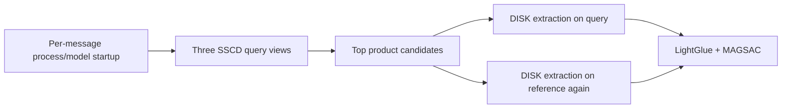

# Decor Moments Image Matcher Latency Optimization Implementation Plan

> **For agentic workers:** REQUIRED SUB-SKILL: Use superpowers:subagent-driven-development (recommended) or superpowers:executing-plans to implement this plan task-by-task. Steps use checkbox (`- [ ]`) syntax for tracking.

**Goal:** Reduce warm CPU response time for the 256-product / 671-reference exact-copy matcher without weakening duplicate-image ambiguity checks, geometric verification, or human-handoff behavior.

**Architecture:** Move reusable work out of the request path. A persistent loopback service loads the models and integrity-checked index once; build time precomputes reference hashes and local features; request time uses an exact-hash fast path, a SIFT/MAGSAC CPU verifier for ordinary copies, and cached-feature LightGlue only for difficult transformations. A stage-level benchmark prevents a faster but less safe configuration from shipping.

**Tech Stack:** Python 3.12, PyTorch 2.9.1 CPU, SSCD TorchScript, OpenCV SIFT + USAC_MAGSAC, DISK, LightGlue, NumPy, Pillow, Flask, pytest.

## Global Constraints

- Keep the matcher standalone until the calibrated negative benchmark passes; do not change WhatsApp, Kapso, or OpenClaw behavior in these tasks.
- Every unverified, ambiguous, duplicate-content, invalid, or operational case remains `handoff` or `error`; latency work must never turn it into a catalog match.
- Preserve exact product-ID joins, SHA-256 cache/index integrity, bounded input handling, Shopify host restrictions, and no customer-image retention.
- Keep all model files, feature stores, cached images, indexes, private evaluation images, and timing traces out of Git.
- Compare latency only after warmup and report cold startup separately from warm request latency.
- The optimization gate is zero false catalog accepts on the agreed negative set, then latency; speed never outranks precision.
- Initial CPU targets on the current Intel i5-8250U are: exact-byte unique copies p95 <= 0.25 seconds, ordinary resized/recompressed copies p95 <= 3 seconds, screenshot/crop positives p95 <= 10 seconds, and LightGlue fallback p95 <= 20 seconds. If a target is missed, publish the measured result rather than weakening thresholds.

---

## Current bottleneck map



The highest-value changes are:

1. keep the model/index process warm;
2. accept unique exact-byte copies without neural inference;
3. precompute reference-side local features;
4. extract query-side features once per view and reuse them;
5. use SIFT/MAGSAC for easy geometric copies and reserve LightGlue for hard cases.

## File responsibility map

- `image-matcher/src/decor_matcher/performance.py` — monotonic stage timers, percentile summaries, and benchmark result schema.
- `image-matcher/src/decor_matcher/feature_store.py` — immutable, checksummed SIFT and DISK reference-feature persistence keyed by reference SHA-256.
- `image-matcher/src/decor_matcher/fast_verification.py` — exact-hash routing, perceptual-hash ranking, SIFT matching, and MAGSAC measurements.
- `image-matcher/src/decor_matcher/verification.py` — DISK extraction and LightGlue matching from already-extracted features.
- `image-matcher/src/decor_matcher/matcher.py` — staged orchestration and query-context reuse.
- `image-matcher/src/decor_matcher/service.py` — persistent loopback API for Hadi's integration.
- `image-matcher/src/decor_matcher/cli.py` — build-feature, benchmark-latency, and serve-api commands.
- `image-matcher/reports/latency-optimization.md` — exact hardware, dataset hashes, accuracy, routing counts, and cold/warm percentiles.

---

### Task 1: Establish stage-level cold and warm latency baselines

**Files:**
- Create: `image-matcher/src/decor_matcher/performance.py`
- Modify: `image-matcher/src/decor_matcher/matcher.py`
- Modify: `image-matcher/src/decor_matcher/cli.py`
- Create: `image-matcher/tests/test_performance.py`
- Modify: `image-matcher/tests/test_cli.py`

**Interfaces:**
- Produces: `StageTimings`, `LatencySummary`, and `benchmark_latency(runtime, queries, warmups, runs)`.
- `CatalogMatcher.match(path, *, timing_sink=None)` retains the existing return type and optionally records named stages without changing decision evidence.

- [ ] **Step 1: Write failing timer and warm-benchmark tests**

```python
def test_stage_timings_are_monotonic_and_serializable(fake_clock):
    timings = StageTimings(clock=fake_clock)
    with timings.stage("sscd"):
        fake_clock.advance(0.125)
    assert timings.as_milliseconds() == {"sscd": 125.0}

def test_latency_benchmark_excludes_warmups(matcher_stub, query):
    report = benchmark_latency(matcher_stub, [query], warmups=2, runs=3)
    assert matcher_stub.calls == 5
    assert report["measured_queries"] == 3
```

- [ ] **Step 2: Run the tests and verify RED**

Run: `python -m pytest image-matcher/tests/test_performance.py image-matcher/tests/test_cli.py -q`

Expected: collection fails because `decor_matcher.performance` and `benchmark-latency` do not exist.

- [ ] **Step 3: Implement timing without putting clocks in decision logic**

```python
@dataclass
class StageTimings:
    clock: Callable[[], float] = time.perf_counter
    milliseconds: dict[str, float] = field(default_factory=dict)

    @contextmanager
    def stage(self, name: str):
        started = self.clock()
        try:
            yield
        finally:
            self.milliseconds[name] = (self.clock() - started) * 1000.0
```

Record these stages separately: `input_validation`, `sscd_query`, `retrieval`, `fast_verification`, `disk_query`, `lightglue_matching`, and `total`. Record `startup_total` around `create_catalog_matcher()` only in the CLI/service layer.

- [ ] **Step 4: Add the bounded CLI benchmark**

```console
python -m decor_matcher benchmark-latency --runtime image-matcher/runtime-full --queries image-matcher/runtime-full/latency-fixtures.json --warmups 2 --runs 5
```

The JSON output must include cold startup, route counts, p50/p95 total latency, and p50/p95 for every stage. A legitimate handoff remains a successful benchmark observation; operational errors make the command exit 1.

- [ ] **Step 5: Run tests, capture the unoptimized baseline, and commit**

Run: `python -m pytest image-matcher/tests/test_performance.py image-matcher/tests/test_cli.py -q`

Commit: `perf: measure matcher stage latency`

---

### Task 2: Add an integrity-safe exact-copy and SIFT fast path

**Files:**
- Create: `image-matcher/src/decor_matcher/fast_verification.py`
- Modify: `image-matcher/src/decor_matcher/index.py`
- Modify: `image-matcher/src/decor_matcher/matcher.py`
- Create: `image-matcher/tests/test_fast_verification.py`
- Modify: `image-matcher/tests/test_matcher.py`

**Interfaces:**
- Produces: `ExactHashLookup`, `SiftVerifier`, and `FastVerificationResult`.
- Consumes the existing `ReferenceRecord.sha256`, duplicate-content groups, `GeometryMetrics`, and MAGSAC acceptance measurements.

- [ ] **Step 1: Write failing unique and duplicate exact-hash tests**

```python
def test_unique_exact_bytes_match_without_encoder_or_lightglue(tmp_path):
    matcher = matcher_with_unique_reference(tmp_path, payload=b"catalog-bytes")
    result = matcher.match(write_query(tmp_path, b"catalog-bytes"))
    assert result.decision == "catalog_match"
    assert result.reason == "unique_exact_sha256"
    assert matcher.encoder.calls == 0
    assert matcher.verifier.calls == 0

def test_shared_exact_bytes_handoff_without_neural_inference(tmp_path):
    matcher = matcher_with_same_payload_for_two_products(tmp_path)
    result = matcher.match(write_query(tmp_path, matcher.reference_bytes))
    assert result.decision == "handoff"
    assert result.reason == "ambiguous_reference_image"
```

- [ ] **Step 2: Write failing SIFT/MAGSAC tests**

Use deterministic synthetic keypoints to prove ratio-test filtering, minimum match count, inlier ratio, query coverage, reference coverage, and weak-evidence fallback. A fast-path failure must return `inconclusive`, not `catalog_match` or final `handoff`.

- [ ] **Step 3: Run the focused tests and verify RED**

Run: `python -m pytest image-matcher/tests/test_fast_verification.py image-matcher/tests/test_matcher.py -q`

- [ ] **Step 4: Implement exact hash before image decoding**

Stream-hash the bounded query file. Map a digest to the set of product IDs and reference records already verified by `load_index()`. Accept only when the set contains exactly one product; return ambiguity when it contains more than one product. This route is cryptographic identity, so it does not require SSCD or geometry.

- [ ] **Step 5: Implement SIFT as a strong-but-conservative verifier**

```python
class SiftVerifier:
    def __init__(self, nfeatures: int = 1500, ratio: float = 0.75):
        self.extractor = cv2.SIFT_create(nfeatures=nfeatures)
        self.matcher = cv2.BFMatcher(cv2.NORM_L2)
```

Use two-nearest-neighbor matching, Lowe's ratio test, and the existing `estimate_geometry()` MAGSAC function. Initial SIFT acceptance must be at least as strict as LightGlue: 20 inliers, 0.30 inlier ratio, and 0.10 coverage on both images. Treat those numbers as experimental until Task 6 calibration; weak SIFT evidence falls through to LightGlue.

- [ ] **Step 6: Run real transformed-copy and similar-image regressions**

Require exact byte, JPEG-55, 50% resize, screenshot frame, and text overlay positives to preserve their expected decisions. Require every duplicate-content group and all existing negative fixtures to remain handoff.

- [ ] **Step 7: Commit**

Commit: `perf: add safe exact and SIFT match routes`

---

### Task 3: Precompute checksummed reference-side local features

**Files:**
- Create: `image-matcher/src/decor_matcher/feature_store.py`
- Modify: `image-matcher/src/decor_matcher/verification.py`
- Modify: `image-matcher/src/decor_matcher/cli.py`
- Create: `image-matcher/tests/test_feature_store.py`
- Modify: `image-matcher/tests/test_verification.py`

**Interfaces:**
- Produces: `ReferenceFeatureStore.build(records, extractor_config)` and `ReferenceFeatureStore.load(reference_sha256)`.
- Each feature manifest binds the reference SHA-256, extractor name, model SHA-256, resize value, keypoint limit, tensor shapes/dtypes, and feature-payload SHA-256.
- Supports `sift-v1` and `disk-v1`; a corrupt, mismatched, oversized, or incomplete store fails startup.

- [ ] **Step 1: Write failing atomic-store and integrity tests**

```python
def test_feature_store_rejects_reference_or_model_generation_mismatch(tmp_path):
    store = build_fake_store(tmp_path, reference_sha="a" * 64, model_sha="b" * 64)
    with pytest.raises(FeatureStoreError):
        store.load("c" * 64, expected_model_sha="b" * 64)

def test_feature_store_decodes_the_same_verified_snapshot(tmp_path, monkeypatch):
    store = build_fake_store(tmp_path)
    replace_file_after_snapshot(monkeypatch, store)
    assert store.load(EXPECTED_SHA).keypoints.tolist() == ORIGINAL_KEYPOINTS
```

- [ ] **Step 2: Run tests and verify RED**

Run: `python -m pytest image-matcher/tests/test_feature_store.py -q`

- [ ] **Step 3: Implement bounded immutable `.npz` feature payloads**

Use one content-addressed feature payload per byte-distinct reference image. Validate regular-file status and maximum bytes before one immutable read, verify SHA-256, then call `np.load(BytesIO(snapshot), allow_pickle=False)`. SIFT payloads contain `keypoints`, `descriptors`, and `image_size`; DISK payloads contain `keypoints`, `descriptors`, `keypoint_scores`, and `image_size`.

- [ ] **Step 4: Split DISK extraction from LightGlue matching**

```python
class LightGlueVerifier:
    def extract(self, image: Image.Image | Path) -> LocalFeatures: ...
    def verify_features(
        self,
        query: LocalFeatures,
        reference: LocalFeatures,
        reprojection_px: float = 5.0,
    ) -> GeometryMetrics: ...
```

The existing `verify(query, reference)` remains as a compatibility wrapper that calls `extract()` twice and then `verify_features()`.

- [ ] **Step 5: Add the build command and run it for all 600 distinct payloads**

```console
python -m decor_matcher build-local-features --runtime image-matcher/runtime-full --sift --disk --keypoints 2048 --resize 1024
```

The command must report total references, distinct payloads, reused features, generated features, failures, artifact hashes, and elapsed time. Any missing feature aborts publication of the generation.

- [ ] **Step 6: Run focused/full tests and commit**

Commit: `perf: precompute catalog local features`

---

### Task 4: Reuse query features across candidate verification

**Files:**
- Modify: `image-matcher/src/decor_matcher/matcher.py`
- Modify: `image-matcher/src/decor_matcher/verification.py`
- Modify: `image-matcher/tests/test_matcher.py`
- Modify: `image-matcher/tests/test_verification.py`

**Interfaces:**
- Produces internal `QueryContext` containing normalized views, SSCD vectors, lazy SIFT features, and lazy DISK features keyed by view name.
- `CatalogMatcher` loads reference features by `Candidate.reference_sha256` and never extracts reference DISK during a request.

- [ ] **Step 1: Write failing reuse tests**

```python
def test_query_disk_features_are_extracted_once_per_view_across_candidates():
    matcher, extractor = matcher_with_three_rejected_candidates_same_view()
    matcher.match(QUERY)
    assert extractor.query_calls == ["full"]
    assert extractor.reference_calls == []
```

- [ ] **Step 2: Verify RED, implement lazy query caches, and verify GREEN**

Do not eagerly compute DISK for all views. Compute it only when SIFT was inconclusive and a LightGlue candidate from that view is reached. Close/release image and tensor objects after the result to bound resident memory.

- [ ] **Step 3: Add a no-feature-store fail-closed regression**

Production service startup with an absent or mismatched full feature generation must fail readiness. An explicitly nonproduction test matcher may use the compatibility extractor path.

- [ ] **Step 4: Run the full suite and commit**

Commit: `perf: reuse query and catalog features`

---

### Task 5: Add the persistent loopback matcher service for OpenClaw integration

**Files:**
- Create: `image-matcher/src/decor_matcher/service.py`
- Modify: `image-matcher/src/decor_matcher/cli.py`
- Create: `image-matcher/tests/test_service.py`
- Modify: `image-matcher/README.md`

**Interfaces:**
- Produces `create_match_service(runtime: Path, matcher=None) -> Flask`.
- Produces CLI command `serve-api --runtime PATH --port 7870` bound only to `127.0.0.1`.
- `GET /health` returns readiness, reference count, distinct-reference count, model hashes, and feature-generation hashes.
- `POST /match` accepts one bounded multipart image and returns the existing `MatchResult` JSON schema plus timing metadata.

- [ ] **Step 1: Write failing startup/readiness/request tests**

Test that models and indexes initialize before the socket reports readiness, malformed or oversized files fail closed, uploads are deleted in `finally`, only one JSON response is emitted, and missing feature generations prevent startup.

- [ ] **Step 2: Implement one warm matcher per process**

Create the matcher in the application factory, not inside the request function. Use a bounded semaphore of one CPU inference request initially; a full queue returns HTTP 503 with `reason="matcher_busy"` so OpenClaw can retain human handoff instead of creating an unbounded memory queue.

- [ ] **Step 3: Add an integration contract example**

```http
POST http://127.0.0.1:7870/match
Content-Type: multipart/form-data; boundary=...

image=@customer.jpg
```

Only `decision="catalog_match"` may proceed to a product reply. `handoff`, `error`, HTTP 413, HTTP 503, timeout, or connection failure must preserve the current human-handoff flow.

- [ ] **Step 4: Run service tests and a 20-request warm-process soak**

Assert no temporary uploads remain, resident memory stabilizes after warmup, all result schemas are valid, and the process never reloads model artifacts between requests.

- [ ] **Step 5: Commit**

Commit: `feat: add warm local matcher service`

---

### Task 6: Calibrate routes, tune LightGlue, and enforce performance gates

**Files:**
- Modify: `image-matcher/src/decor_matcher/verification.py`
- Modify: `image-matcher/src/decor_matcher/cli.py`
- Create: `image-matcher/tests/test_latency_acceptance.py`
- Create: `image-matcher/reports/latency-optimization.md`
- Modify: `image-matcher/README.md`

**Interfaces:**
- Consumes stage timings, route decisions, the full 671-reference runtime, and a versioned evaluation manifest.
- Produces a committed report and selected configuration; it does not change thresholds unless the calibration split and untouched final split are both reported.

- [ ] **Step 1: Create deterministic evaluation splits**

Use 30 reference images selected by SHA-256 product/reference ordering and generate the existing five transformations for 150 positives. Store at least 100 owner-approved private negative images under ignored `image-matcher/eval/private-negatives/`, with a committed manifest containing only opaque case IDs, labels, and SHA-256 digests. Split once by digest: 60% calibration and 40% final evaluation.

- [ ] **Step 2: Benchmark route configurations without tuning on the final split**

Compare:

- SIFT `nfeatures`: 1000, 1500, 2000;
- Lowe ratio: 0.70, 0.75, 0.80;
- DISK keypoints: 1024 and 2048;
- LightGlue resize: 768 and 1024;
- current and proposed geometry thresholds.

Reject a configuration immediately if it creates one false catalog accept on calibration negatives. Rank the survivors by positive acceptance and warm p95 latency. Run the chosen configuration exactly once on the untouched final split.

- [ ] **Step 3: Enforce the gate in an acceptance test**

```python
def test_published_latency_report_meets_safety_gate():
    report = load_report_json(REPORT_JSON)
    assert report["final_false_accepts"] == 0
    assert report["final_operational_errors"] == 0
    assert report["exact_sha256_p95_ms"] <= 250
    assert report["warm_total_p95_ms"] <= 10_000
```

If latency misses but safety passes, the test records the miss as an explicit non-release result rather than changing evidence thresholds.

- [ ] **Step 4: Publish cold/warm and route-specific evidence**

Report hardware, Python/model versions, artifact and dataset hashes, route counts, recall by transformation, all handoffs/errors, false accepts, cold startup, warm p50/p95, stage p50/p95, memory, and the exact selected configuration. State prominently that no WhatsApp behavior changed.

- [ ] **Step 5: Run final verification and commit**

Run:

```powershell
image-matcher/.venv/Scripts/python -m pytest image-matcher/tests -q
image-matcher/.venv/Scripts/python -m compileall -q image-matcher/src image-matcher/tests
git diff --check
git status --short
```

Commit: `test: publish matcher latency acceptance evidence`

---

## Integration handoff for Hadi

After Task 6 passes:

1. run `serve-api` as a supervised persistent process beside the OpenClaw/Kapso bridge;
2. set a request timeout slightly above measured warm p95, never above the WhatsApp workflow's human-handoff timeout;
3. send product information only for `catalog_match`;
4. preserve the existing image handoff for every other outcome;
5. log decision, route, latency, and non-image identifiers only—never retain the uploaded customer image;
6. deploy behind a feature flag and shadow-run before customer replies are enabled.

## Teaching notes

- **Offline versus online computation:** catalog features change only when the catalog changes, so compute them once at build time. Customer-image features are online work and dominate request latency.
- **Cold versus warm latency:** loading 150 MB of model weights and verifying 671 cached files is startup cost, not a fair per-message measurement. A persistent worker separates the two.
- **Cascade design:** cheap high-precision tests run first; expensive general tests run only when earlier evidence is inconclusive.
- **Fast paths need stronger proofs, not weaker rules:** exact SHA-256 is safe because it proves byte identity. Perceptual hashes and embeddings only retrieve candidates; geometry still proves transformed copies.
- **Latency and accuracy are coupled:** fewer keypoints and lower resolution are faster, but they may remove the evidence needed to reject similar furniture. That tradeoff must be measured on untouched negatives.
- **Fail-closed ML is a systems property:** queue overflow, corrupt features, timeouts, duplicate catalog images, and model exceptions all belong in the decision policy, not only in infrastructure logs.
- **Throughput differs from latency:** one CPU worker may answer one image quickly but cannot handle many concurrent images. Add replicas only after measuring memory and preserving one warm matcher per process.

## Execution handoff

Implement task-by-task with subagent-driven development and a review gate after every task. Keep the latency work on a new branch based on `feature/decormoments-image-matcher`; do not merge performance experiments into `DecorMomentsBot` until Task 6's final safety gate passes.
